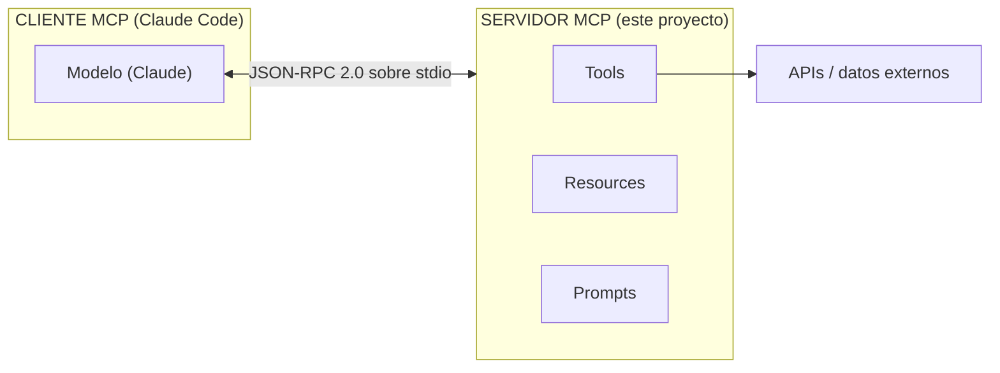
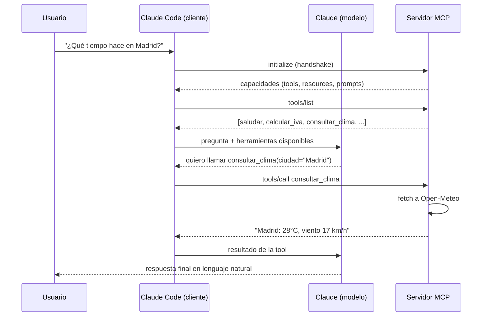

# Servidor MCP didáctico — explicación completa

Documento de apoyo para la clase de **Claude Code**. Explica **qué** se ha
implementado en [`mcp-didactico/`](../mcp-didactico/) y, sobre todo, **por qué**
se ha hecho así.

---

## 1. ¿Qué es MCP?

**MCP (Model Context Protocol)** es un protocolo abierto y estándar que permite a
un modelo de lenguaje (como Claude, dentro de Claude Code) conectarse con
**herramientas y datos externos** de forma uniforme y segura.

La idea clave: en vez de que cada aplicación invente su propia forma de dar
"superpoderes" al modelo, todos hablan el **mismo protocolo**. Un servidor MCP
que escribas hoy sirve para Claude Code, para la app de escritorio y para
cualquier otro cliente compatible. Es "el USB-C de las herramientas para IA".

### Arquitectura cliente ↔ servidor



- El **cliente** (Claude Code) arranca el **servidor** como un proceso hijo.
- Se comunican con mensajes **JSON-RPC 2.0**.
- El servidor expone capacidades; el cliente las descubre y las usa.

---

## 2. Las tres capacidades de un servidor MCP

Un servidor MCP puede exponer tres cosas distintas. Es **la idea central** que
deben entender los alumnos:

| Capacidad     | Analogía HTTP | ¿Quién decide usarlo?      | Ejemplo aquí                         |
| ------------- | ------------- | -------------------------- | ------------------------------------ |
| **Tools**     | `POST` (acción) | El **modelo**, cuando cree que ayuda | `saludar`, `calcular_iva`, `consultar_clima` |
| **Resources** | `GET` (lectura) | La **aplicación/usuario** al adjuntar contexto | `notas://curso`, `alumno://{id}/perfil` |
| **Prompts**   | Plantilla     | El **usuario**, al invocar un comando | `revisar-codigo`                      |

> Regla mnemotécnica: **Tools = verbos** (hacer algo), **Resources = sustantivos**
> (leer algo), **Prompts = plantillas** (empezar una conversación preparada).

---

## 3. Qué se ha implementado y por qué

### 3.1 Tools

#### `saludar` — el "hola mundo"
Recibe un `nombre` y devuelve un saludo.
**Por qué está:** es el ejemplo mínimo para ver el flujo completo
*entrada validada → handler → `content` de salida* sin ruido.

#### `calcular_iva` — validación de tipos
Recibe `base` (número positivo) y `tipo` (opcional, por defecto 21).
**Por qué está:** muestra que los parámetros están **tipados y validados con
Zod**. Si llegan datos inválidos, el SDK rechaza la llamada *antes* de ejecutar
tu código. Enseña que no hace falta validar a mano.

#### `consultar_clima` — API externa real
Recibe una `ciudad`, llama a la API pública **Open-Meteo** (sin API key) en dos
pasos (geocoding → forecast) y devuelve el tiempo actual.
**Por qué está:** es el caso realista. Enseña tres cosas importantes:
1. Un handler puede ser **asíncrono** y esperar (`await`) llamadas de red.
2. `fetch` es **global en Node 18+**, no hace falta instalar nada.
3. Hay que **gestionar errores**: si la ciudad no existe o la red falla, se
   devuelve un resultado con `isError: true` en vez de reventar el servidor.

### 3.2 Resources

#### `notas://curso` — recurso estático
URI fija que siempre devuelve el mismo texto (las notas del curso).
**Por qué está:** el recurso más simple. Ideal para exponer documentación o
configuración de solo lectura.

#### `alumno://{id}/perfil` — recurso dinámico
Usa una `ResourceTemplate` con un parámetro `{id}` en la URI. Pedir
`alumno://2/perfil` hace que `id = "2"` llegue al handler.
**Por qué está:** muestra recursos **parametrizados**, como una ruta con
variables en una API REST.

### 3.3 Prompts

#### `revisar-codigo` — plantilla reutilizable
Recibe un fragmento de `codigo` y genera un mensaje ya preparado para que Claude
lo revise.
**Por qué está:** enseña que un servidor puede empaquetar **prompts de calidad**
que el usuario lanza como comando (en Claude Code aparecen como
`/mcp-didactico:revisar-codigo`), en vez de reescribir el mismo prompt cada vez.

---

## 4. Flujo de una llamada a una Tool (paso a paso)



El punto clave para los alumnos: **el modelo no ejecuta código**. Solo *decide*
qué herramienta llamar; el **servidor** es quien ejecuta y devuelve datos.

---

## 5. Decisiones técnicas (el "por qué" de fondo)

### ¿Por qué el SDK `@modelcontextprotocol/sdk` v1 y no el v2 beta?
Existe un paquete nuevo `@modelcontextprotocol/server` v2, pero está en **beta**.
Para docencia se usa el **SDK estable v1.29.0**: más documentación, menos
sorpresas y API asentada.

### ¿Por qué transporte STDIO?
Hay dos transportes habituales: **stdio** (proceso local por entrada/salida
estándar) y **HTTP/SSE** (servidor remoto). Se ha elegido **stdio** porque:
- Es el que Claude Code usa **por defecto**.
- No necesita puertos, red ni despliegue: arranca y funciona.
- Es lo más fácil de explicar en clase.

### ¿Por qué `console.error` y nunca `console.log`?
Con stdio, el **stdout** (donde escribe `console.log`) es el canal del protocolo
JSON-RPC. Si escribes ahí, **rompes la comunicación**. Los logs de depuración van
por **stderr** con `console.error`, que el cliente ignora.

### El detalle que más confunde: `inputSchema` es un objeto plano
En el SDK v1, `inputSchema` y `argsSchema` son un **objeto de campos Zod**:

```ts
inputSchema: { nombre: z.string() }        // ✅ correcto
inputSchema: z.object({ nombre: z.string() }) // ❌ error típico
```

Es el fallo número uno al empezar. Merece la pena remarcarlo en clase.

---

## 6. Cómo ejecutarlo y registrarlo

### Instalar y compilar
```bash
cd mcp-didactico
npm install
npm run build
```

### Probarlo en vivo con el Inspector (recomendado en clase)
```bash
npm run inspector
```
Abre una UI web para invocar las tools y leer los resources sin necesidad de
Claude. Perfecto para demostrar el protocolo.

### Registrarlo en Claude Code
Ya hay un [`.mcp.json`](../.mcp.json) listo en la raíz del proyecto:

```json
{
  "mcpServers": {
    "mcp-didactico": {
      "command": "node",
      "args": ["mcp-didactico/build/server.js"]
    }
  }
}
```

Al abrir Claude Code en la raíz, detectará el servidor. Compruébalo con:

```bash
claude mcp list
```

> La ruta es **relativa** a la raíz del proyecto. Si mueves el servidor, usa una
> ruta absoluta en su lugar.

---

## 7. Mapa de archivos

```
04-Claude Code/
├── .mcp.json                 # Registro del servidor para Claude Code (raíz)
├── docs/
│   └── mcp-servidor-didactico.md   # Este documento
└── mcp-didactico/
    ├── src/server.ts         # El servidor, comentado paso a paso
    ├── build/server.js       # Compilado (se genera con npm run build)
    ├── package.json
    ├── tsconfig.json
    └── README.md             # Guía rápida de uso
```

---

## 8. Resumen de una frase

> Un servidor MCP expone **Tools** (acciones que el modelo invoca), **Resources**
> (datos que se leen) y **Prompts** (plantillas), y este proyecto implementa un
> ejemplo real y probado de cada uno para enseñar el protocolo de principio a fin.
